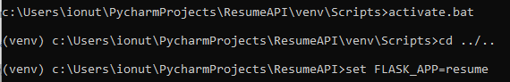

# Flask CV API and UI
 
This is a Python Flask application that presents a CV (resume) as a JSON REST API with endpoints for personal information, work experience, and education, as well as a user interface for viewing the data.

## 1.JSON REST API Installation and Usage

1. Clone the repository to your local machine:
```
git clone https://github.com/ionutlng/ResumeAPI.git
```

2. Install the necessary Python packages:
```
cd ResumeAPI
pip install -r requirements.txt
```

3. Start the Flask development server:
```
python resume.py
```

4. Open your web browser and navigate to http://localhost:5000/ to view the user interface. The API endpoints can be accessed at http://localhost:5000/personal, http://localhost:5000/experience, and http://localhost:5000/education.

## API Endpoints
The API provides the following endpoints:

* **GET /personal**: Returns personal information such as name, email, phone, location, summary and skill list.
* **GET /experience**: Returns a list of work experience items, including job title, company name, dates of employment and job description.
* **GET /education**: Returns a list of education items, including degree type, institution name and dates of attendance.
The API responses are returned in JSON format.

## User Interface
The user interface provides a simple way to view the CV data in a web browser. Each section is displayed on a separate page and includes formatted content with appropriate labels and headings.

## 2. CLI commands that prints the data to the console Installation and Usage

1. Activate the virtual environment from Scripts folder and change directory to ResumeAPI: 

   

2. Set flask application to resume:
```
set FLASK_APP=resume
```

3. Run the application:
```
flask json_data
```
    
